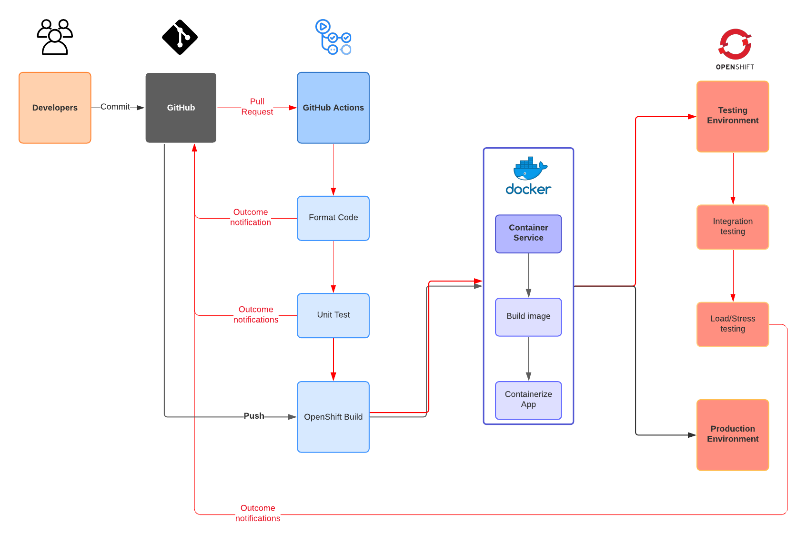

# **Building CI/CD for API Project Proposal**

###### EC528

###### Team Members: Panat Taranat, Yan Chen, Mella Liang, Peter Wang, Kaito Yamagishi
###### Mentors: James Colley, Surya Jayanthi, Ata Turk

## 1. Vision and Goals of the Project:

We are working on a CI/CD pipeline that can be used for API development. We will use an example of a URL shortener API as a demonstration of our pipeline, though our solution will be platform agnostic. The pipeline will allow incremental changes to be developed, tested, verified, and deployed in an automated manner. Following core DevOps principles will allow the project team to strive for continuous improvement with minimal downtime, and to respond quickly to customer feedback and insights.

Important goals include:

* (Almost) Fully automated setup and deployment. The entire process for a developer to make changes to the codebase should require as little manual interaction as possible. Same with someone who is looking to use our repo as a GitHub template for their own project.
* The URL shortener API will be served on an attractive interface
* Unit tests can be written and integrated into the pipeline
* From the first deployment, the API and pipeline will have high availability

## 2. Users/Personas of the Project:

An API user is Andy, a web developer working on his SaaS that allows users to write notes in the cloud. Andy wants to let his users be able to share links to specific notes or notebooks but the generated link system he currently has is ugly, long, and hard to remember (see notion.so). Andy reads our API documentation and forks our open source project to generate short, two word URLs for his service with his domain name. Andy’s version of the API is hosted on his own cloud provider that supports Docker images. Andy can contribute features and bug fixes back to our open source project, thanks to our CI/CD pipeline.

A user of the CI/CD pipeline is Brian, a participant in a hackathon. Brian is working on a prototype of his team’s web application. To save time, Brian uses our GitHub Template Repository as a starting point for his project. He can add on additional functionality by choosing Actions from the GitHub marketplace. Although our project is set-up to deploy on MOC OpenShift, Brian can easily change his deployment to AWS or Heroku.

## 3. Scope and Features of the Project:

**In-Scope Features**

* Allow adding and running of unit tests in CI
* Easy installation and configuration of the pipeline, can be customized to different projects and hosts
* Extensible in functionality, either by using Actions from GitHub marketplace or writing own Actions
* The API being developed should have high availability, a failed test should not bring down the service
* Every commit or pull-request by a developer will go through CI/CD pipeline, must pass all tests before being deployed
* Failed builds and tests will alert developers
* Ensure the security of secrets and sensitive data/tokens in the pipeline

**Out-of-Scope Features (not delivered as part of MVP)**

* Backwards compatibility with Jenkins
* Dashboard interface for developers to see problems and status of CI/CD pipeline
* The URL shortener API is a demonstration, so extensive development or design of the shortener API is not in scope

## 4. Solution Concept

The system components of the architectural design is as follows:
* Python Flask backend for providing REST APIs that allow frontend to consume
* React front end for service’s user interface
* Nginx load balancer, among client-application, application-database, application-cache
* GitHub Actions for CI/CD pipeline
* Ubuntu docker image for development environment
* OpenShift on MOC for hosting
* Build Server, builds docker images of Flask app from Dockerfile
* Test server, for running smoke, unit, integration tests

In the diagram, when developers make any changes in the code and the commits are pushed to GitHub, GitHub Actions triggers the CI workflow. It builds the project with the changed contents, runs integration and unit tests, and then provides results of the tests in the pull request. If the changes introduce errors, the developer can go back to debugging. If there are no errors from the tests, the change is ready to be reviewed by another team member. When the team member approves the changes, from here it is the CD workflow. The changes get reflected to the staging server, then if there are no problems, the changes will be deployed to the production server hosted on MOC using OpenShift. This server is running Nginx, load balancing the server’s resource availability and efficiency.

We will be developing unit tests alongside the development of the URL shortener. These tests will allow us to verify the proper function of various system components, such as backend and frontend.

Design decisions for the architecture were made with usability and ease of development in mind. We compared the features of GitHub Actions to Jenkins and found the following:

**GH Actions**

* Better community support and bigger extension marketplace than Jenkins
* Uses common scripting languages, JS and bash
* Infrastructure as Code, our workflow defines the process
* Built-in integration with GitHub, useful for many open source projects

**Jenkins**
* Very mature, over 9 years old, with lots of documentation and answered questions
* Highly extensible, but some plugins are poorly maintained or has conflicts
* Uses master/node relationships
* Need to learn Groovy script (Java-like syntax)
* High support overhead, we will need at least one person dedicated to Jenkins always

We assume that many developers of open source projects are familiar with the GitHub ecosystem, so using GitHub Actions, Packages, and Templates will increase our reach as well as ease-of-use. GH Actions also has built-in integrations with common deployment targets, like AWS, Azure, Heroku, and Google Cloud.

## 5. Acceptance Criteria

Minimum acceptance criteria is a CI/CD pipeline for an API developed and tested with our example URL shortener API. It will detect all commits and pull requests in a GitHub repository, and run the pipeline defined by our GitHub actions configurations. This will build a docker image, run tests, and deploy the changes to a running production server with no stoppage.

* Push to production is one-click, fully automated
* Any code that does not build or passes tests will not make it to production
* Generic and extensible, can be easily implemented by an API developer using Flask/Python

## 6. Release Planning:

Release 1 (Deadline: Sept. 27, Demo: Oct. 1)
- Find dictionary library for shortened links
- Write algorithm that convert link to shortened form
- RESTful API code
  - Post route to convert URL to shortened link
  - Get route to access original URL via shortened link
  - Delete route to delete shortened link or expired data
  - Put route to change URL to different shortened link
- CI/CD pipeline
  - Make final decisions on technologies and implement them with code
  - Set up a GitHub actions workflow that will detect a push (source) then cause some action
  - Explore added options on the yaml file
  - Explore tests: write tests on PyTest, implement on GitHub actions and successfully accept/reject new pushes to the repository
- Back end testing on API codeTest each API route, write different test cases
- Decide on a NoSQL database (leaning toward MongoDB)
- Tests may include:
  - Formatting using pep8
  - Token-based authentication
  - Test short link generation
  - Test API routes
- Decide on a NoSQL database (leaning toward MongoDB)

Release 2 (Deadline: Oct. 11, Demo: Oct. 15)
- Functional UI interface for core features
- Unit tests for front end and back end
- CI/CD pipeline
  - Create build stage that creates a docker container with the contents that was updated
  - Make sure the source is getting past the build stage
  - Work on deploy stages
    - First host on the staging server, then after final confirmation deploy to production
- At this point, core features of the API and the CI/CD pipeline should be functional and highly available

Release 3 (Deadline: Oct. 25, Demo: Oct. 29)
- This release will focus on tuning performance and testing
- Add cache for frequently used links + unit testing
- CI/CD pipeline
  - Work on test stage; write, debug and run the test files
  - Implement smoke, unit and integration testing

Release 4 (Deadline: Nov. 8, Demo: Nov. 12)
- Attempt to add Out-of-Scope features + integration testing
- CI/CD pipeline
  - Explore the extensibility and application of our pipeline to other projects
  - Work on areas that need improvement for better usability

Release 5 (Deadline: Nov. 29, Demo: Dec. 3)
- Ensure every part of project is functional, stable, and verified
- Check current state of product with MVP, acceptance criteria
- Complete documentation on how to use our pipeline in other projects
